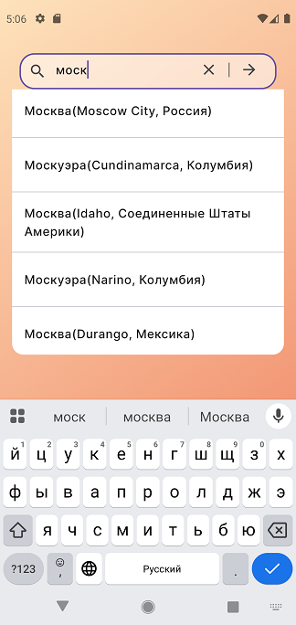
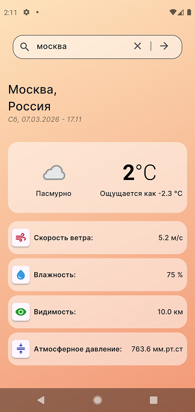

# f_weather

An example of the Weather app on Flutter.

  ,


## 🌦️ f_weather

Приложение для отслеживания погоды, построенное на современных архитектурных паттернах Flutter. Проект демонстрирует чистую реализацию поиска локаций и получения данных о погоде в реальном времени. 

## 🚀 Стек технологий

Core: Flutter SDK (3.5.3)  
State Management: Riverpod (StateNotifier + Providers)  
Asynchronous Tools: Async package (Cancelable Operations для предотвращения Race Conditions)  
Networking: HTTP  
Formatting: Intl (локализация дат и чисел)  

## 🏗️ Архитектурные особенности

Debouncing: Оптимизация поисковых запросов через Timer для уменьшения нагрузки на API.  
Race Conditions Handling: Использование CancelableOperation для игнорирования устаревших ответов сервера при быстром вводе.  
Auto-Update: Механизм автоматического обновления данных при смене часа через Stream.periodic.  
Safety: Безопасное управление жизненным циклом подписок (StreamSubscription) и предотвращение утечек памяти.  
Repository Pattern: Полная изоляция логики получения данных от логики отображения.  

## 🛠️ Установка и запуск

Клонируйте репозиторий:

```bash

git clone https://github.com/Fednov/f_weather

```

Установите зависимости:

```bash

flutter pub get

```

Запустите приложение:

```bash

flutter run

```